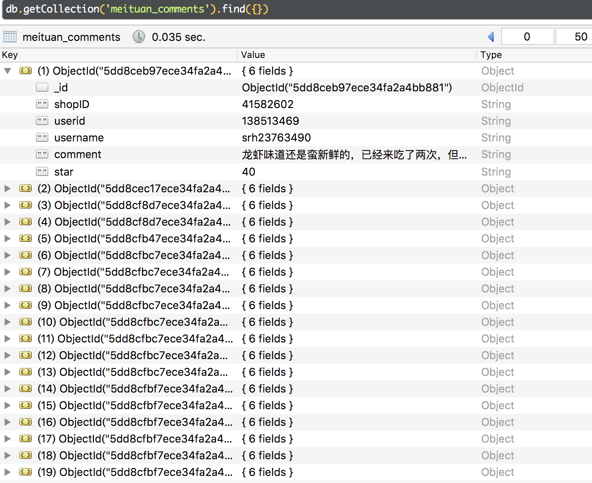
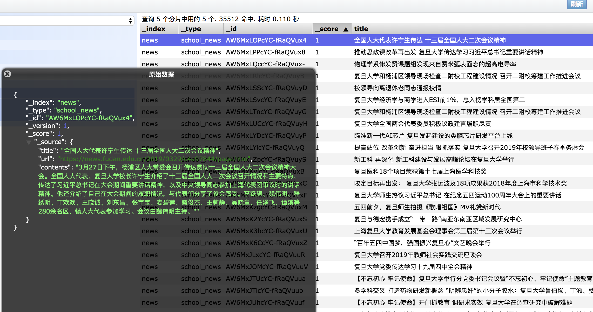

## Scrapy
* [分布式Scrapy-Redis虾米音乐爬虫](https://github.com/994047477/Scrapy_Learning/tree/master/xiami)     

## 美团店铺爬虫和 商家信息爬虫

-  电子商务数据课程大作业

-  存到mongoDB 中，反扒措施，详见代码

- 
- 

## 复旦校园网新闻爬虫 

- 分布式系统课程作业
- 存到elasticsearch中用于索引，搜索， 

- 

